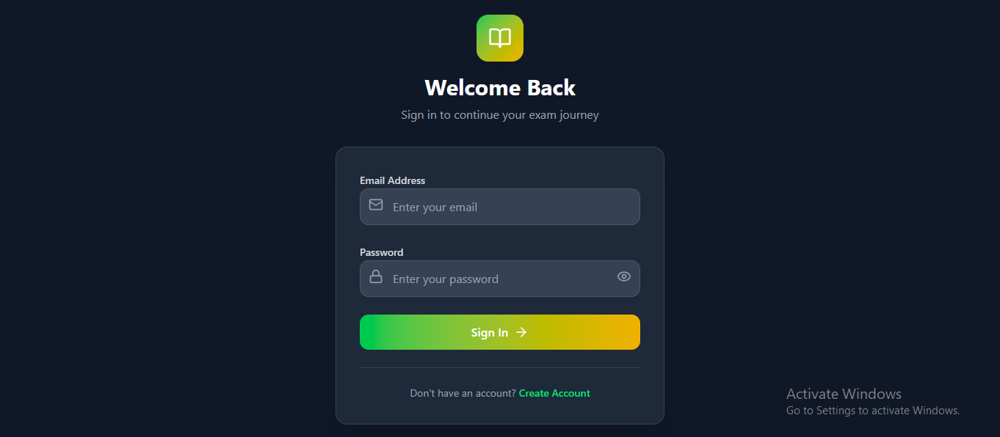
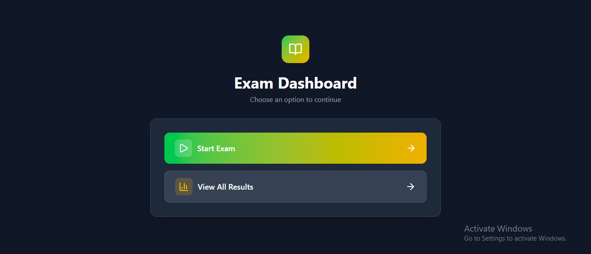
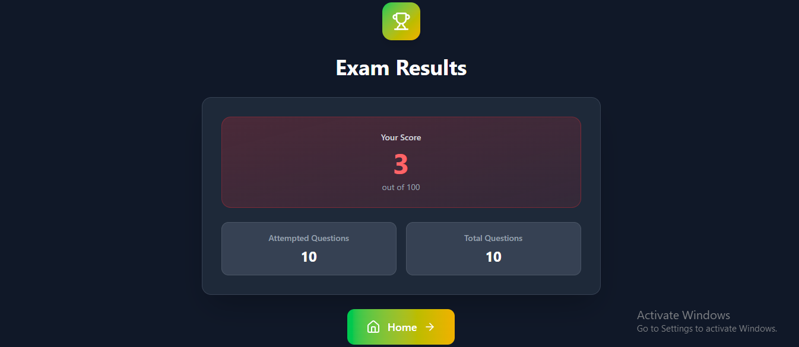

# Exam Taking App (Student-Side Only)

This is the **frontend** for the Student Exam Taking Application built with **React + Vite**, styled with **Tailwind CSS**, and enhanced with **Toast notifications** for user feedback.  
The app consumes the backend APIs (authentication, exam management, etc.) and provides a smooth, responsive UI.

---

## 📸 Screenshots

### 🔹 Login Page  


### 🔹 Home Page  


### 🔹 Result Page 


## 🚀 Features

- 🔐 **Authentication System**

  - Login & Logout with JWT token storage in `localStorage`.
  - Auto-restore session on page reload with loading state handling.
  - Protected routes using `React Router`.

- 🛡️ **Protected Routes**

  - Only authenticated users can access dashboard and exam-related pages.
  - Redirects unauthenticated users to the login page.

- 🎨 **Modern UI**

  - Styled with **Tailwind CSS** for a responsive and minimal design.
  - Reusable components for consistent look and feel.

- 🔔 **Toast Notifications**
  - User-friendly feedback for login success, logout, and error handling.

---

## 🛠️ Tech Stack

- **React**
- **Vite**
- **React Router DOM**
- **Tailwind CSS**
- **React Hot Toast**
- **Context API** for authentication management

---

## 📦 Installation & Running the Application

Follow these steps to initialize and run the frontend application:

### 1. Clone the repository

```bash
git clone https://github.com/binayak597/exam-app.git
cd exam-app/frontend
```

### 2. Install dependencies

```bash
npm install
```

### 3. Configure Environment Variables

If required, create a `.env` file in the `frontend` directory and add your API base URL or other environment variables.  
Example:

```env
VITE_API_URL=http://localhost:8000/api/v1.0
```

### 4. Start the development server

```bash
npm run dev
```

The app will be available at [http://localhost:5173](http://localhost:5173) by default.

### 5. Build for production

To create an optimized production build:

```bash
npm run build
```

## 📝 Notes

- Ensure the backend server is running and accessible at the API URL specified in your `.env` file.
- For any issues, refer to the backend documentation .

---

## 🧑‍💻 Author

Built by Binayak Mukherjee 🚀
